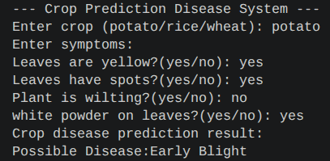

# Crop Disease Prediction System

A CLI Python program that predicts potential crop diseases based on user input. The system currently supports disease prediction for potato, rice, and wheat crops by evaluating observable symptoms provided by user.

## Project Structure

The code is divided into three modules & a main script to separate functionality and make the code cleaner:

* `main.py`: The main point of the program. It uses the modules and runs the main loop.
* `inputs.py`: Handles inputs from the user for the crop type and yes/no answers regarding specific symptoms (yellow leaves, spots, wilting, white powder).
* `predictor.py`: Contains the conditional logic & predefined diseases list. It evaluates the provided crop and symptoms to determine & return the possible disease.
* `loop_handler.py`: Manages the program loop, asking the user if they wish to evaluate another crop or not.

## How to Use

1. Ensure all four files (`main.py`, `inputs.py`, `predictor.py`, `utils.py`) are saved in the same folder.
2. Open a terminal or command prompt.
3. Navigate to the folder containing the files.
4. Run the program by executing:

```bash
python main.py
```
To run on linux:
```bash
python main.py
```
5. Follow the prompts to enter the crop name (potato/rice/wheat) and answer the symptom questions with "yes" or "no".

## Image



## Author
Neeraj Prajapati